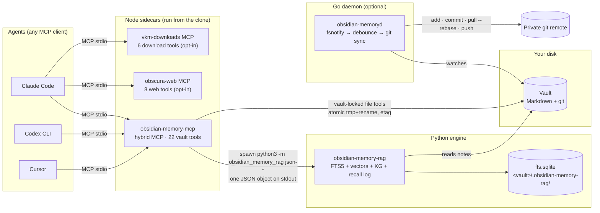
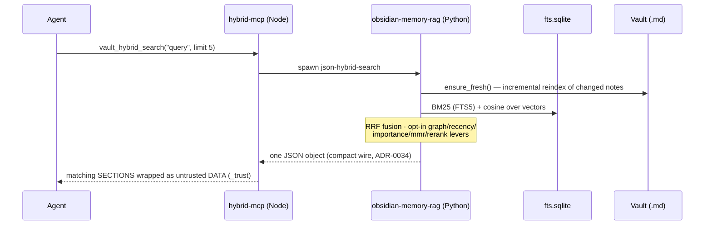
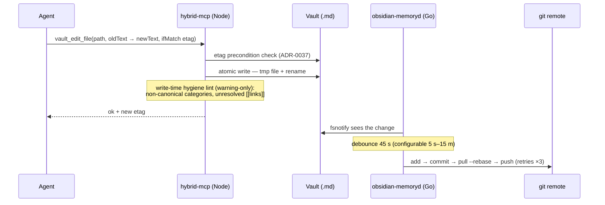
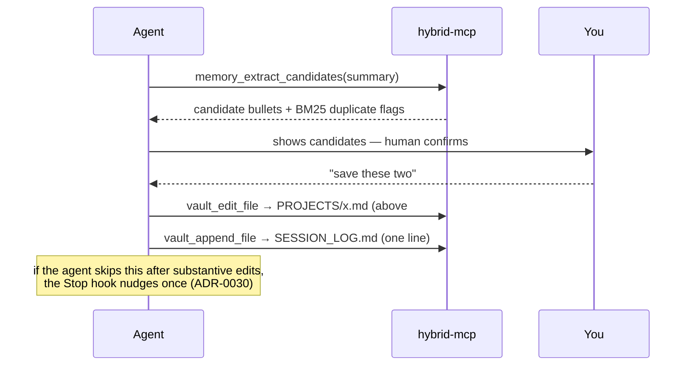
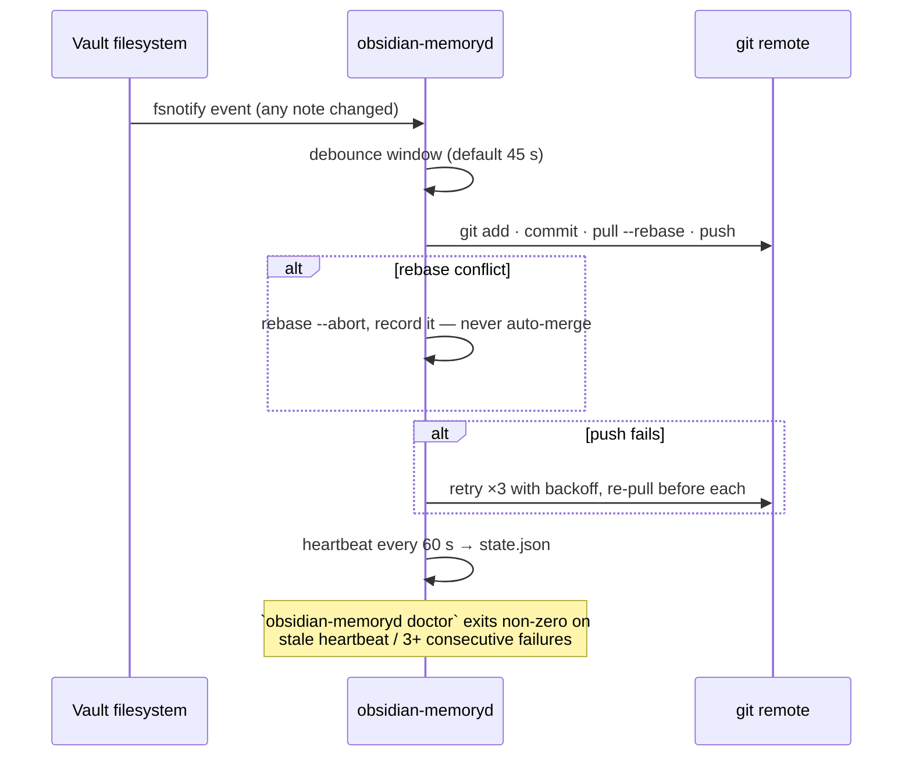
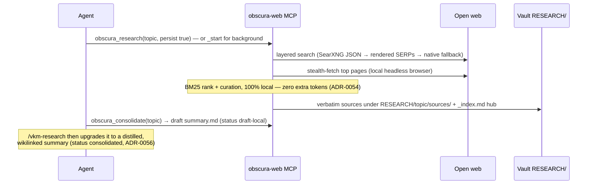
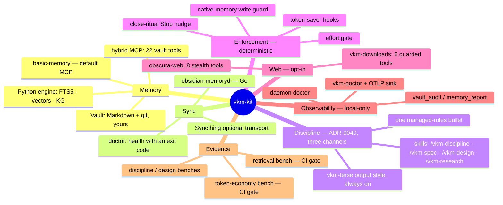

> [🇪🇸 Español](../es/arquitectura-a-fondo.md) · 🇬🇧 English

# Architecture deep dive — every piece, every connection

This is the full walkthrough of how the kit works **as built** — derived from the code,
cross-checked against the [ADRs](../adr/README.md), and drift-gated where a table can be
(the tool list below is enforced by `tool-doc-drift.test.mjs`). For the 5-minute mental
model read [how it works](how-it-works.md) first; for the contributor-oriented short map
see [`ARCHITECTURE.md`](../../ARCHITECTURE.md).

## 1. The system, whole

Four languages, one job: give an agent durable, searchable, git-backed memory it can't
corrupt and you can always audit.

Beside the data path, the installer (`create-vkm-kit`) wires four **side channels** into
Claude Code — all deterministic, all fail-open, all removable:

| Channel            | Hook / asset                                                                                  | What it does                                                                                               |
| ------------------ | --------------------------------------------------------------------------------------------- | ---------------------------------------------------------------------------------------------------------- |
| Session context    | `session-start-vault-context.mjs` (SessionStart)                                              | Injects the vault's top-level map + compressed index at session start (ADR-0029).                          |
| Memory enforcement | `guard-native-memory-write.mjs` (PreToolUse) + `stop-vault-close-reminder.mjs` (Stop)         | Denies writes to Claude's disabled native memory; nudges a close ritual after substantive work (ADR-0030). |
| Token saver        | `compact-tool-output.mjs` + `compact-mcp-output.mjs` (PostToolUse) + `vkm-terse` output style | Compacts noisy shell/MCP output before it enters context; diagnostic lines are hard-preserved (ADR-0043).  |
| Telemetry          | `ensure-otel-sink.mjs` (SessionStart) → `vkm-otel-sink` on `127.0.0.1:4319`                   | Local-only token/cache metrics for `vkm-doctor` (ADR-0044).                                                |

## 2. Data flows, operation by operation

### Recall (`vault_hybrid_search`)

The agent reads a ~150–250-token **passage**, not the whole note — the measured median
saving vs whole-note reads is 62% at `limit: 3` (ADR-0032/0034, CI-gated by `bench-tokens`).

### Write (`vault_write_file` / `vault_edit_file` / `vault_append_file`)

### Close ritual (end of a working session)

### Sync (the daemon's loop)

### Research (obscura, opt-in)

## 3. The kit as a mind map

## 4. Decision map — what holds each piece up

Every load-bearing behavior traces to an ADR. The full list is
[`docs/adr/`](../adr/README.md) (61 records); these are the structural ones:

| Piece / behavior                                                | ADR                                                                                                                                                                                                   |
| --------------------------------------------------------------- | ----------------------------------------------------------------------------------------------------------------------------------------------------------------------------------------------------- |
| Markdown vault + `basic-memory` as the default MCP              | [0010](../adr/0010-migrate-to-basic-memory.md)                                                                                                                                                        |
| Go daemon replaces scripts; sync order add→commit→pull→push     | [0012](../adr/0012-go-daemon-cross-platform.md), [0004](../adr/0004-sync-order-add-commit-pull-push.md)                                                                                               |
| Hybrid retrieval: FTS5 + vectors, pluggable embedders           | [0014](../adr/0014-hybrid-retrieval-sqlite-vec.md), [0017](../adr/0017-hybrid-query-embeddings.md)                                                                                                    |
| Passage-first reads + untrusted-DATA envelope                   | [0018](../adr/0018-multi-agent-token-efficiency.md)                                                                                                                                                   |
| Retrieval quality as a CI gate (recall/MRR/nDCG/MAP)            | [0020](../adr/0020-measured-retrieval-quality.md), [0021](../adr/0021-ranking-upgrades-and-graded-metrics.md)                                                                                         |
| Graph/recency/importance/MMR/rerank ranking levers (all opt-in) | [0019](../adr/0019-graph-aware-retrieval.md), [0026](../adr/0026-cross-encoder-reranker.md), [0027](../adr/0027-type-weighted-graph-and-importance.md), [0028](../adr/0028-mmr-and-passage-window.md) |
| Typed knowledge graph: relations + observations                 | [0023](../adr/0023-structured-knowledge-graph.md)                                                                                                                                                     |
| Native auto-memory off; vault is the single memory              | [0029](../adr/0029-disable-claude-native-auto-memory.md)                                                                                                                                              |
| Deterministic hooks instead of prose rules                      | [0030](../adr/0030-deterministic-enforcement-hooks.md), [0031](../adr/0031-effort-gate-hook.md)                                                                                                       |
| Token discipline, measured; compact wire; default limit 10      | [0032](../adr/0032-token-discipline-and-token-economy-benchmark.md), [0034](../adr/0034-compact-wire-format-and-lower-default-limit.md)                                                               |
| Fixed-cost budgets: tool schemas ≤8k chars, rules-block diet    | [0035](../adr/0035-fixed-cost-diet-schema-budget.md), [0036](../adr/0036-rules-block-diet-and-drift-gate.md)                                                                                          |
| Vault = memory, not system of record; etag preconditions        | [0037](../adr/0037-vault-vs-database-system-of-record.md)                                                                                                                                             |
| Evolutionary memory: pin failures, usage boost                  | [0038](../adr/0038-evolutive-memory-loop.md)                                                                                                                                                          |
| Token-saver hooks + terse output style                          | [0043](../adr/0043-token-saver-posttooluse-compaction.md)                                                                                                                                             |
| Local-only telemetry + `vkm-doctor`                             | [0044](../adr/0044-doctor-telemetry-local-otlp-sink.md)                                                                                                                                               |
| `assemble_context` single budgeted call                         | [0045](../adr/0045-assemble-context-single-call.md)                                                                                                                                                   |
| Discipline doctrine in three channels; skills                   | [0049](../adr/0049-discipline-doctrine-three-channels.md), [0053](../adr/0053-vkm-design-skill.md)                                                                                                    |
| Stealth web layer + local deep research                         | [0051](../adr/0051-obscura-web-stealth-browser.md), [0054](../adr/0054-obscura-research-local-deep-crawl.md), [0057](../adr/0057-obscura-research-gather-over-rank.md)                                |
| RESEARCH/ knowledge bank, dual consolidation                    | [0056](../adr/0056-research-knowledge-bank.md)                                                                                                                                                        |
| Guarded downloads with background jobs                          | [0058](../adr/0058-vkm-downloads-file-download-tool.md), [0059](../adr/0059-vkm-downloads-background-jobs-and-mirrors.md)                                                                             |
| Self-update with a never-clobber contract; skill structure gate | [0061](../adr/0061-kit-update-and-skill-structure-gate.md)                                                                                                                                            |

## 5. The tool surface at a glance (22 + 8 + 6)

The **authoritative, drift-gated** table of the 22 vault tools lives in
[`packages/obsidian-memory-mcp/README.md`](../../packages/obsidian-memory-mcp/README.md).
Condensed:

| Server                                                                 | Tools | Groups                                                                                                                                                                                                                                                                                                                                                                                                                                                                                                                                          |
| ---------------------------------------------------------------------- | ----- | ----------------------------------------------------------------------------------------------------------------------------------------------------------------------------------------------------------------------------------------------------------------------------------------------------------------------------------------------------------------------------------------------------------------------------------------------------------------------------------------------------------------------------------------------- |
| **obsidian-memory-hybrid** (default with `--with-hybrid`/`--full`)     | 22    | Search & retrieval (`vault_hybrid_search`, `vault_fts_search`, `vault_fts_index`, `vault_complete`, `assemble_context`) · knowledge graph (`vault_relations`, `vault_observations`, `vault_kg_suggest`) · vault-locked files (`vault_read_file`, `vault_write_file`, `vault_edit_file`, `vault_append_file`, `vault_frontmatter_set`, `vault_delete_file`, `vault_move_file`, `vault_list_directory`, `vault_backlinks`, `vault_git_history`) · hygiene (`vault_audit`, `vault_memory_report`, `vault_rotate_log`, `memory_extract_candidates`) |
| **obscura-web** (opt-in `--obscura`, on under `--full`)                | 8     | `obscura_fetch`, `obscura_fetch_many`, `obscura_search`, `obscura_research`, `obscura_research_start`, `obscura_research_status`, `obscura_research_stop`, `obscura_consolidate`                                                                                                                                                                                                                                                                                                                                                                |
| **vkm-downloads** (opt-in `--downloads`, deliberately NOT in `--full`) | 6     | `download_resolve`, `download_file`, `probe_mirrors`, `download_start`, `download_status`, `download_cancel`                                                                                                                                                                                                                                                                                                                                                                                                                                    |

Three cross-cutting properties, all test-pinned:

1. **Untrusted-data envelope** — every payload read from the vault or the web is flagged
   as DATA, never instructions (`_trust`, injection heuristics).
2. **Schema budget** — the 22 tools' descriptions fit in ≤8,000 chars (ADR-0035): schemas
   are input tokens every wired agent pays every session.
3. **Vault lock** — file tools resolve paths inside the vault only; the vault location
   comes from the server's environment, never from the wire.

## 6. Who writes what (ownership map)

| Writer                    | Writes                                                          | Never writes                                               |
| ------------------------- | --------------------------------------------------------------- | ---------------------------------------------------------- |
| Agent via vault tools     | Notes (`MEMORY.md`, `PROJECTS/`, `SESSION_LOG.md`, …)           | `RESEARCH/` (pipeline-owned), `.obsidian-memory-rag/`      |
| Python engine             | `fts.sqlite` sidecar (index, vectors, KG, recall log)           | Notes                                                      |
| obscura research pipeline | `RESEARCH/<topic>/` (sources, hub, draft summary)               | Anything outside `RESEARCH/`                               |
| Go daemon                 | git history (commits, pushes)                                   | Note contents                                              |
| Installer                 | IDE configs, managed rules blocks, hooks, skills (hash-tracked) | Your edits — modified files are never clobbered (ADR-0061) |

That separation is why the kit stays auditable: content changes are always either yours
or your agent's, always in git, and always recoverable (`vault_git_history` reaches
old versions even after a permanent delete).
