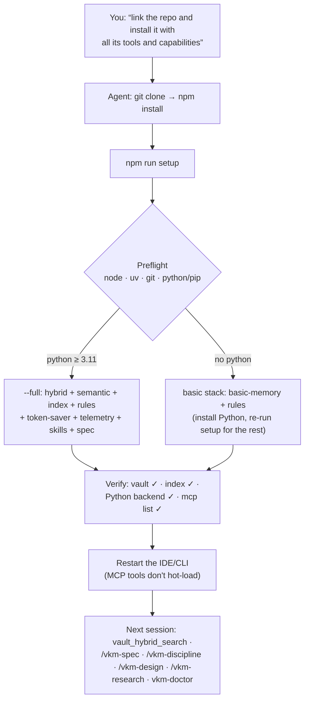

> [🇪🇸 Español](../es/instalar-con-agente.md) · 🇬🇧 English

# Install with an agent (paste it into the chat)

Don't want to follow the [manual guide](install.md)? Paste the block below into a **Cursor** or
**Claude Code** chat: the agent installs and verifies everything, and you just **approve the
commands**. Works for both IDEs — no clone needed for the basic install.

> ## ⚠️ Before pasting — this is a `curl … | sh`-class action
>
> The block authorizes an agent to install an npm package, edit your MCP config, and touch git.
> Paste it **only from this repo** (<https://github.com/Vahlame/create-vkm-kit>) and check the
> package it installs is **`@vkmikc/create-vkm-kit`**. If anything looks off, paste nothing
> and open an issue.

---

## ⚡ Simplest: link the agent to the repo and say "install it"

If you have (or let the agent clone) the repo, you don't need to paste a long prompt — there's a
single **self-verifying entry point**. Just tell the agent exactly this:

> “Clone <https://github.com/Vahlame/create-vkm-kit> and **install it with all its tools and
> capabilities**: cd into it and run `npm install` then `npm run setup`. I'll approve the
> commands.”

The agent should end up running exactly this (and nothing else — reject any other command):

```bash
git clone https://github.com/Vahlame/create-vkm-kit
cd create-vkm-kit
npm install
npm run setup            # options: npm run setup -- --vault "<PATH>" --ide codex,claude --lang en
```

`npm run setup` **preflights** dependencies (`node`, `uv`, `git`, `python`/`pip`), **auto-detects**
which agent CLIs are on PATH (`codex`, `claude`; falls back to Cursor), runs the **`--full`**
install, **verifies** (vault on disk, index built, Python backend importable,
`codex/claude mcp list`) and prints a status table. `npm run setup:dry` previews it with zero
writes.



### What "all its tools and capabilities" means

With Python ≥ 3.11 present, `npm run setup` installs the complete 4.0 suite in one pass:

| Piece                                                                                                                | What it gives you                                                                                                                                                |
| -------------------------------------------------------------------------------------------------------------------- | ---------------------------------------------------------------------------------------------------------------------------------------------------------------- |
| **Vault + `basic-memory` MCP**                                                                                       | Markdown memory that survives across chats (read/write/search), version-pinned                                                                                   |
| **`obsidian-memory-hybrid` MCP**                                                                                     | passage-first search (BM25 + semantic + graph), typed knowledge graph, `vault_audit`, memory reports                                                             |
| **FTS index + sqlite-vec**                                                                                           | search by meaning, accelerated — in `<VAULT>/.obsidian-memory-rag/`                                                                                              |
| **Memory rules**                                                                                                     | the agent protocol as an idempotent marked block in `~/.claude/CLAUDE.md`, `AGENTS.md` and `.cursor/rules/`                                                      |
| **token-saver** _(Claude Code)_                                                                                      | noisy-output compaction hooks + artifact deny rules + the `vkm-terse` output style (ADR-0043)                                                                    |
| **Local telemetry + `vkm-doctor`** _(Claude Code)_                                                                   | OTLP sink at `127.0.0.1:4319`; `npm run doctor` reports tokens, cost and cache health — nothing leaves your machine (ADR-0044)                                   |
| **`/vkm-discipline`, `/vkm-spec`, `/vkm-design` & `/vkm-research` skills + `vkm-implementer` agent** _(Claude Code)_ | dense-code discipline + the idea→spec pipeline anchored to the vault + the anti-generic design method + consolidating `RESEARCH/` (ADR-0049, ADR-0053, ADR-0056) |
| **vkm-spec GUI**                                                                                                     | idea to XML spec at `127.0.0.1:4923`, runs from the clone                                                                                                        |
| **Ollama + `phi4-mini`** _(≈2.3 GB; best-effort)_                                                                    | local spec drafting; if it fails or you skip it with `--no-ollama`, vkm-spec uses its deterministic fallback (ADR-0047)                                          |
| **Memory hooks** _(Claude Code)_                                                                                     | native auto-memory OFF + deterministic enforcement + effort-gate (ADR-0029/0030/0031)                                                                            |

Pieces marked _(Claude Code)_ install only if the `claude` CLI is on PATH (or you pass
`--ide claude`). Without a kit clone, the hybrid part degrades to `basic-memory` with a warning —
it never aborts.

> **Honest limit:** registering an MCP does **not** make its tools live in the current session — no
> agent can hot-load its own MCP. After `npm run setup`, **restart** Claude Code / Codex (or reload
> the Cursor window); the memory tools (`vault_hybrid_search`, …) answer in the **next** session. The
> agent can confirm wiring with `claude mcp list` / `codex mcp list`.

No clone (npx-only, basic install)? Use the prompt below.

---

**Copy from here down into a new agent chat:**

---

You are a Cursor or Claude Code agent. Install and **verify** the **Markdown memory** system on
this machine. Run each command, **report its result**, and ask for approval before anything that
installs software.

**1 · Prerequisites.** These must exist; install whatever is missing, then have me reopen the
terminal so `PATH` refreshes:

```bash
node --version   # ≥ 20
uvx --version    # any — runs the basic-memory MCP
git --version    # any
```

> Windows: `winget install OpenJS.NodeJS.LTS astral-sh.uv Git.Git` · macOS: `brew install node uv git`.

**2 · Install — one command.** Ask me for the vault folder (default
`~/Documents/obsidian-memory-vault`, on Windows `%USERPROFILE%\Documents\obsidian-memory-vault`);
call it `<VAULT>`. Run the line matching the IDE you're running in — ask me if you're unsure:

```bash
# Cursor
npx @vkmikc/create-vkm-kit "<VAULT>" -y --rules all

# Claude Code  (registers via `claude mcp add`, not mcp.json)
npx @vkmikc/create-vkm-kit "<VAULT>" -y --ide claude --rules all
```

One command does it all: creates the vault if missing (`START_HERE.md`, `MEMORY.md`,
`SESSION_LOG.md`, `PROJECTS/`), wires the version-pinned **`basic-memory`** MCP (backing up any
existing config first), and installs the memory **User Rules** as an idempotent marked block in
`~/.claude/CLAUDE.md`, `./AGENTS.md` and `.cursor/rules/` (never clobbers your content). Show the
output and confirm there were no errors.

**3 · Cursor global rules (Cursor only).** Step 2 already wrote the _project_ rule
(`.cursor/rules/obsidian-memory.mdc`). For _global_ coverage, show me the marked block (between
the `vkm-kit:start`/`end` markers) and tell me to paste it into
**Cursor → Settings → Rules → User Rules** — Cursor keeps global rules outside any file.
**Claude Code: skip this** — `~/.claude/CLAUDE.md` is already done.

**4 · Restart & verify.** Tell me to run **Developer: Reload Window** (Cursor) or restart Claude
Code. Then, in a new chat, prove it works:

```text
Read START_HERE.md from my vault and tell me what it contains.
```

If the contents come back, report a status table — vault (`<VAULT>`) ✓ · MCP connected ✓ · rules
installed ✓ · read test ✓. If it fails, see [`troubleshooting.md`](troubleshooting.md) →
**MCP / Cursor**.

**5 · (Optional) Hybrid search — large vaults only.** Search by word **and** meaning needs the kit
**cloned** and Python ≥ 3.11. Ask me for a clone path `<KIT>`, then:

```bash
git clone https://github.com/Vahlame/create-vkm-kit "<KIT>"
pip install -e "<KIT>/packages/obsidian-memory-rag[semantic,vec]"
node "<KIT>/packages/create-vkm-kit/src/index.js" -y --vault "<VAULT>" --with-hybrid --semantic --vec --build-index --repo-root "<KIT>"
```

On Claude Code add `--ide claude` to the last line. Restart the IDE; the `obsidian-memory-hybrid`
tools (`vault_hybrid_search`, …) then respond.

---

— end of the block to paste —

> Setting up a **whole fresh machine** (clone your private vault repo, global `CLAUDE.md`, and the
> semantic index in one go)? Use [`install-fresh-pc.md`](install-fresh-pc.md) instead.

**Installed and restarted?** Next stop: the [**usage + situational guide**](usage.md) — which
piece to use in each day-to-day situation.
