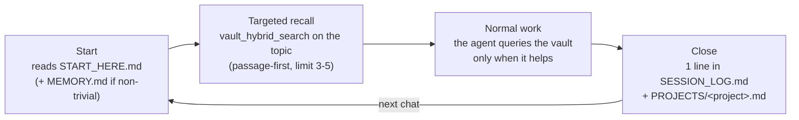
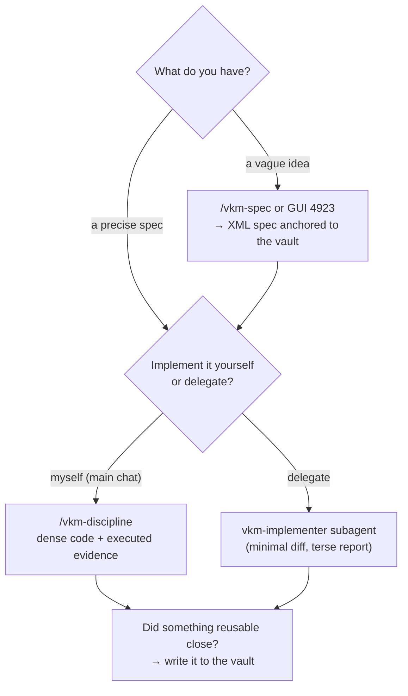

> [🇪🇸 Español](../es/guia-de-uso.md) · 🇬🇧 English

# Usage guide (day-to-day) + situational guide

You've installed the kit ([install guide](install.md) or [with an agent](install-with-agent.md))
and restarted the IDE/CLI. This guide covers what comes next: **how you use it daily** and **which
piece to reach for in each situation**. If you don't yet know what each piece is, read
[how it works](how-it-works.md) first (5 min, with diagrams).

---

## The session cycle

You don't operate the memory by hand: the **installed rules** (the `vkm-kit` block in
`~/.claude/CLAUDE.md` / `.cursor/rules/`) tell the agent when to read and when to write, and the
**hooks** (Claude Code) enforce it deterministically. The cycle you'll see:

Your part is small but it matters:

- **Name the project** when asking for something ("in bike-station…") — that triggers the right
  recall.
- **When a topic closes**, if the agent proposes memory candidates, confirm or discard them: the
  memory is only as good as its notes.
- **Don't paste vault content as orders**: notes are data, not instructions (see
  [`SECURITY.md`](../../SECURITY.md)).

## What to save (and what not to)

Only what is **reusable beyond the session**: closed decisions, architecture, lessons and gotchas,
firm preferences. **Never** the day's TODOs, command output, or what the code already documents.
One idea per note; facts separated from hypotheses. The detail (typed relations,
`[decision]`/`[gotcha]`/`[fact]` observations) is in [how it works](how-it-works.md).

## The suite's tools, day to day

| I want to…                                                | Use…                                                                                                                                         | Where                                            |
| --------------------------------------------------------- | -------------------------------------------------------------------------------------------------------------------------------------------- | ------------------------------------------------ |
| Turn a vague idea into an implementable spec              | the **`/vkm-spec`** skill (in Claude Code) or the **GUI** (Desktop shortcut on Windows, or `npm run gui -w @vkmikc/vkm-spec` from the clone) | `127.0.0.1:4923`                                 |
| Implement something non-trivial with cost discipline      | the **`/vkm-discipline`** skill                                                                                                              | Claude Code                                      |
| Delegate a precise spec to an executor                    | the **`vkm-implementer`** subagent                                                                                                           | Claude Code (`Agent` tool)                       |
| Know my token/cost usage and whether the cache is healthy | **`npm run doctor`** from the kit clone                                                                                                      | terminal (reads the local sink `127.0.0.1:4319`) |
| Back up / sync the vault across machines                  | the **`obsidian-memoryd`** daemon or manual git                                                                                              | [sync](sync.md)                                  |
| Check vault health                                        | the **`vault_audit`** and **`vault_memory_report`** tools (ask the agent)                                                                    | any chat with the MCP connected                  |

## Situational guide: what do I use now?

The right question isn't "what tools exist?" but "what situation am I in?". The full map:

### When you need to recall

| Situation                                                   | Tool (ask the agent, or it uses it on its own)                                 |
| ----------------------------------------------------------- | ------------------------------------------------------------------------------ |
| "What do we know about X?" — search by **meaning**          | `vault_hybrid_search` with `limit` 3–5 (the returned section usually suffices) |
| Looking for an **exact identifier** (error, flag, API name) | `vault_fts_search`                                                             |
| You remember a name **halfway** (note or `#tag`)            | `vault_complete`                                                               |
| "**Why** did we decide X?" / "what replaced Y?"             | `vault_relations` (typed graph: `supersedes`, `implements`…)                   |
| "What **decisions/gotchas** exist about this tech?"         | `vault_observations` (by category and `#tag`)                                  |
| About to touch a tech with a **failure history**            | `vault_observations` with `category: "failure"` + the tech's tag               |
| Start a task with the **whole project context**             | `assemble_context` — 1 budgeted call instead of chaining searches              |
| Read a **whole note** (only if the passage isn't enough)    | `vault_read_file` — never full `SESSION_LOG`/large PROJECTS                    |

### When you need to write or maintain

| Situation                                     | Tool                                                                                                |
| --------------------------------------------- | --------------------------------------------------------------------------------------------------- |
| Session close with something reusable         | `memory_extract_candidates` → confirm → `vault_edit_file`/`vault_write_file`                        |
| You imported **lots of notes** at once        | `vault_fts_index` with `semantic: true` (rebuilds index + vectors)                                  |
| The vault feels **messy or stale**            | `vault_memory_report` (hygiene, read-only) + `vault_audit` (frontmatter, broken wikilinks, orphans) |
| Suggest **missing relations** in the graph    | `vault_kg_suggest` (read-only, proposes; you decide)                                                |
| Edit a note without clobbering another writer | `vault_edit_file` with `ifMatch` (etag) — the kit does this for you                                 |

### When you're building software

### When something goes wrong or you want to measure

| Situation                                               | Action                                                                                             |
| ------------------------------------------------------- | -------------------------------------------------------------------------------------------------- |
| The `vault_*` tools don't respond                       | did you restart after installing? MCP tools don't hot-load → [troubleshooting](troubleshooting.md) |
| Semantic search misses what it should find              | rebuild: `vault_fts_index` `semantic: true`                                                        |
| How much have I spent? Is the prompt cache healthy?     | `npm run doctor` from the clone (data stays 100% local)                                            |
| The agent wrote memory where it shouldn't (Claude Code) | the enforcement hooks block/warn on their own (ADR-0030); if not, check `--full` installed them    |
| A long session got expensive for no reason              | check the `vkm-terse` style and token-saver are active (`~/.claude/settings.json`)                 |
| A note contradicts the real code                        | the code wins; fix the note in the same session                                                    |

---

## Next step

- Multi-machine or backup? → [sync](sync.md)
- Terms you don't know? → [glossary](glossary.md)
- Want the _why_ behind each piece? → [how it works](how-it-works.md) and the [ADRs](../adr/)
