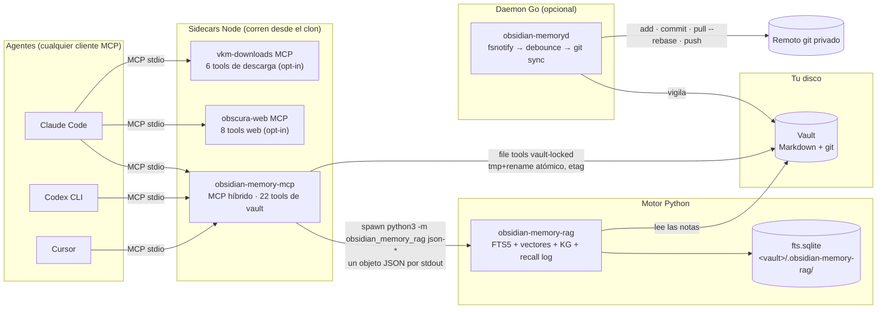
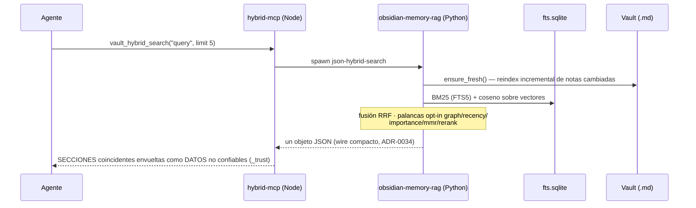
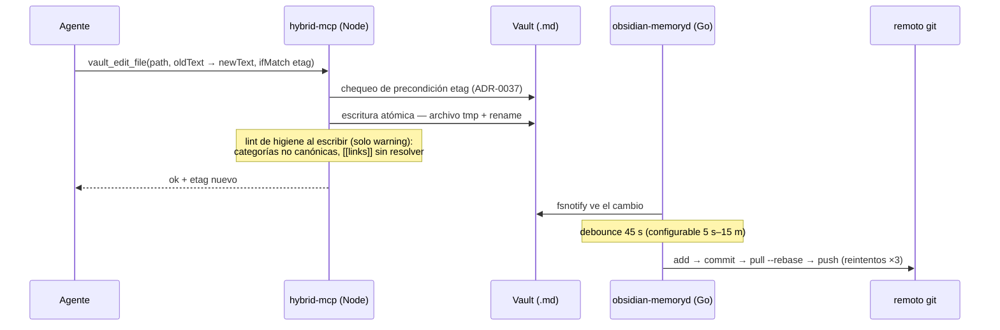
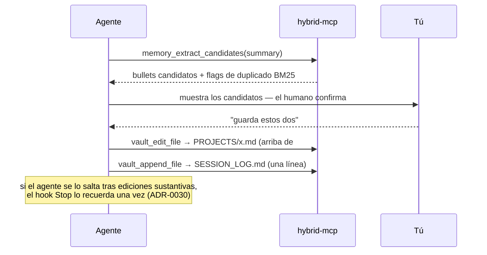
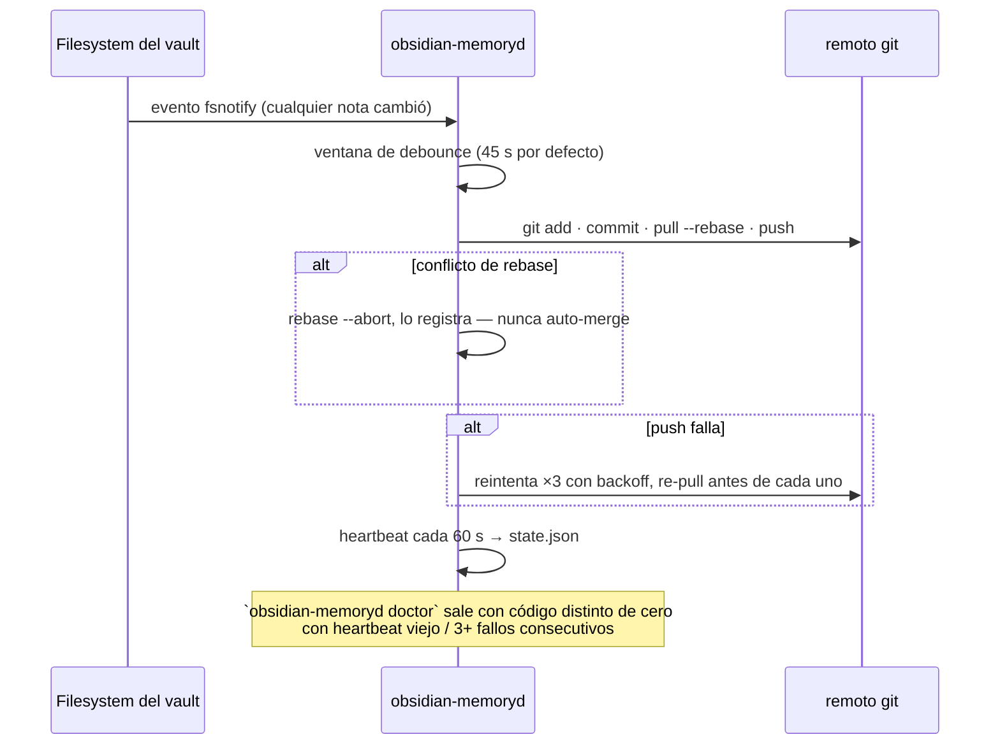
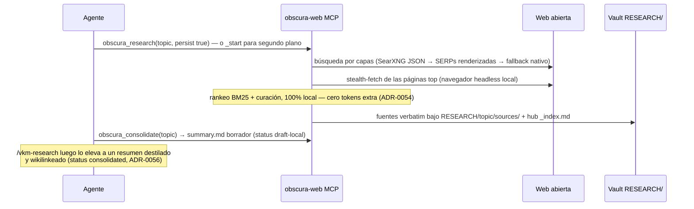
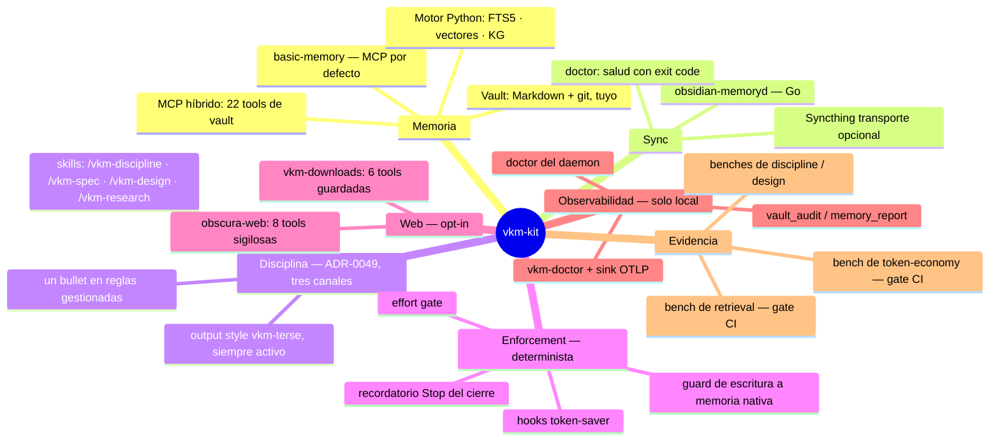

> 🇪🇸 Español · [🇬🇧 English](../en/architecture-deep-dive.md)

# Arquitectura a fondo — cada pieza, cada conexión

Este es el recorrido completo de cómo funciona el kit **tal como está construido** —
derivado del código, contrastado con los [ADRs](../adr/README.md), y con gate anti-drift
donde una tabla lo permite (la lista de tools de abajo la vigila `tool-doc-drift.test.mjs`).
Para el modelo mental de 5 minutos lee primero [cómo funciona](como-funciona.md); para el
mapa corto orientado a contribuidores está [`ARCHITECTURE.md`](../../ARCHITECTURE.md) (inglés).

## 1. El sistema entero

Cuatro lenguajes, un trabajo: darle al agente una memoria duradera, buscable y respaldada
por git que no puede corromper y que tú siempre puedes auditar.

Junto al camino de datos, el instalador (`create-vkm-kit`) conecta cuatro **canales
laterales** en Claude Code — todos deterministas, todos fail-open, todos removibles:

| Canal                  | Hook / asset                                                                                  | Qué hace                                                                                                                                |
| ---------------------- | --------------------------------------------------------------------------------------------- | --------------------------------------------------------------------------------------------------------------------------------------- |
| Contexto de sesión     | `session-start-vault-context.mjs` (SessionStart)                                              | Inyecta el mapa top-level del vault + índice comprimido al arrancar la sesión (ADR-0029).                                               |
| Enforcement de memoria | `guard-native-memory-write.mjs` (PreToolUse) + `stop-vault-close-reminder.mjs` (Stop)         | Deniega escrituras a la memoria nativa desactivada de Claude; recuerda el cierre tras trabajo sustantivo (ADR-0030).                    |
| Token saver            | `compact-tool-output.mjs` + `compact-mcp-output.mjs` (PostToolUse) + output style `vkm-terse` | Compacta output ruidoso de shell/MCP antes de que entre al contexto; las líneas diagnósticas se preservan con garantía dura (ADR-0043). |
| Telemetría             | `ensure-otel-sink.mjs` (SessionStart) → `vkm-otel-sink` en `127.0.0.1:4319`                   | Métricas de tokens/caché solo locales para `vkm-doctor` (ADR-0044).                                                                     |

## 2. Flujos de datos, operación por operación

### Recall (`vault_hybrid_search`)

El agente lee un **pasaje** de ~150–250 tokens, no la nota entera — el ahorro mediano
medido vs leer notas enteras es 62% con `limit: 3` (ADR-0032/0034, gateado en CI por
`bench-tokens`).

### Escritura (`vault_write_file` / `vault_edit_file` / `vault_append_file`)

### Ritual de cierre (final de una sesión de trabajo)

### Sync (el bucle del daemon)

### Research (obscura, opt-in)

## 3. El kit como mapa mental

## 4. Mapa de decisiones — qué sostiene cada pieza

Cada comportamiento estructural se remonta a un ADR. La lista completa está en
[`docs/adr/`](../adr/README.md) (61 registros, en inglés); estos son los estructurales:

| Pieza / comportamiento                                                    | ADR                                                                                                                                                                                                   |
| ------------------------------------------------------------------------- | ----------------------------------------------------------------------------------------------------------------------------------------------------------------------------------------------------- |
| Vault Markdown + `basic-memory` como MCP por defecto                      | [0010](../adr/0010-migrate-to-basic-memory.md)                                                                                                                                                        |
| Daemon Go reemplaza scripts; orden de sync add→commit→pull→push           | [0012](../adr/0012-go-daemon-cross-platform.md), [0004](../adr/0004-sync-order-add-commit-pull-push.md)                                                                                               |
| Retrieval híbrido: FTS5 + vectores, embedders enchufables                 | [0014](../adr/0014-hybrid-retrieval-sqlite-vec.md), [0017](../adr/0017-hybrid-query-embeddings.md)                                                                                                    |
| Lecturas passage-first + envelope de DATOS no confiables                  | [0018](../adr/0018-multi-agent-token-efficiency.md)                                                                                                                                                   |
| Calidad de retrieval como gate de CI (recall/MRR/nDCG/MAP)                | [0020](../adr/0020-measured-retrieval-quality.md), [0021](../adr/0021-ranking-upgrades-and-graded-metrics.md)                                                                                         |
| Palancas de ranking graph/recency/importance/MMR/rerank (todas opt-in)    | [0019](../adr/0019-graph-aware-retrieval.md), [0026](../adr/0026-cross-encoder-reranker.md), [0027](../adr/0027-type-weighted-graph-and-importance.md), [0028](../adr/0028-mmr-and-passage-window.md) |
| Knowledge graph tipado: relaciones + observaciones                        | [0023](../adr/0023-structured-knowledge-graph.md)                                                                                                                                                     |
| Auto-memoria nativa apagada; el vault es la única memoria                 | [0029](../adr/0029-disable-claude-native-auto-memory.md)                                                                                                                                              |
| Hooks deterministas en vez de reglas en prosa                             | [0030](../adr/0030-deterministic-enforcement-hooks.md), [0031](../adr/0031-effort-gate-hook.md)                                                                                                       |
| Disciplina de tokens medida; wire compacto; limit 10 por defecto          | [0032](../adr/0032-token-discipline-and-token-economy-benchmark.md), [0034](../adr/0034-compact-wire-format-and-lower-default-limit.md)                                                               |
| Presupuestos de coste fijo: schemas ≤8k chars, dieta del bloque de reglas | [0035](../adr/0035-fixed-cost-diet-schema-budget.md), [0036](../adr/0036-rules-block-diet-and-drift-gate.md)                                                                                          |
| Vault = memoria, no system of record; precondiciones etag                 | [0037](../adr/0037-vault-vs-database-system-of-record.md)                                                                                                                                             |
| Memoria evolutiva: pin de fallos, boost por uso                           | [0038](../adr/0038-evolutive-memory-loop.md)                                                                                                                                                          |
| Hooks token-saver + output style terso                                    | [0043](../adr/0043-token-saver-posttooluse-compaction.md)                                                                                                                                             |
| Telemetría solo local + `vkm-doctor`                                      | [0044](../adr/0044-doctor-telemetry-local-otlp-sink.md)                                                                                                                                               |
| `assemble_context`: una sola llamada presupuestada                        | [0045](../adr/0045-assemble-context-single-call.md)                                                                                                                                                   |
| Doctrina de disciplina en tres canales; skills                            | [0049](../adr/0049-discipline-doctrine-three-channels.md), [0053](../adr/0053-vkm-design-skill.md)                                                                                                    |
| Capa web sigilosa + deep research local                                   | [0051](../adr/0051-obscura-web-stealth-browser.md), [0054](../adr/0054-obscura-research-local-deep-crawl.md), [0057](../adr/0057-obscura-research-gather-over-rank.md)                                |
| Banco de conocimiento RESEARCH/, consolidación dual                       | [0056](../adr/0056-research-knowledge-bank.md)                                                                                                                                                        |
| Descargas guardadas con jobs en segundo plano                             | [0058](../adr/0058-vkm-downloads-file-download-tool.md), [0059](../adr/0059-vkm-downloads-background-jobs-and-mirrors.md)                                                                             |
| Self-update con contrato never-clobber; gate de estructura de skills      | [0061](../adr/0061-kit-update-and-skill-structure-gate.md)                                                                                                                                            |

## 5. La superficie de tools de un vistazo (22 + 8 + 6)

La tabla **autoritativa y drift-gated** de las 22 tools de vault vive en
[`packages/obsidian-memory-mcp/README.md`](../../packages/obsidian-memory-mcp/README.md)
(inglés). Condensada:

| Servidor                                                              | Tools | Grupos                                                                                                                                                                                                                                                                                                                                                                                                                                                                                                                                               |
| --------------------------------------------------------------------- | ----- | ---------------------------------------------------------------------------------------------------------------------------------------------------------------------------------------------------------------------------------------------------------------------------------------------------------------------------------------------------------------------------------------------------------------------------------------------------------------------------------------------------------------------------------------------------- |
| **obsidian-memory-hybrid** (por defecto con `--with-hybrid`/`--full`) | 22    | Búsqueda y retrieval (`vault_hybrid_search`, `vault_fts_search`, `vault_fts_index`, `vault_complete`, `assemble_context`) · knowledge graph (`vault_relations`, `vault_observations`, `vault_kg_suggest`) · archivos vault-locked (`vault_read_file`, `vault_write_file`, `vault_edit_file`, `vault_append_file`, `vault_frontmatter_set`, `vault_delete_file`, `vault_move_file`, `vault_list_directory`, `vault_backlinks`, `vault_git_history`) · higiene (`vault_audit`, `vault_memory_report`, `vault_rotate_log`, `memory_extract_candidates`) |
| **obscura-web** (opt-in `--obscura`, activo bajo `--full`)            | 8     | `obscura_fetch`, `obscura_fetch_many`, `obscura_search`, `obscura_research`, `obscura_research_start`, `obscura_research_status`, `obscura_research_stop`, `obscura_consolidate`                                                                                                                                                                                                                                                                                                                                                                     |
| **vkm-downloads** (opt-in `--downloads`, adrede FUERA de `--full`)    | 6     | `download_resolve`, `download_file`, `probe_mirrors`, `download_start`, `download_status`, `download_cancel`                                                                                                                                                                                                                                                                                                                                                                                                                                         |

Tres propiedades transversales, todas pinneadas por tests:

1. **Envelope de datos no confiables** — todo payload leído del vault o de la web se
   marca como DATOS, nunca instrucciones (`_trust`, heurísticas de injection).
2. **Presupuesto de schema** — las descriptions de las 22 tools caben en ≤8.000 chars
   (ADR-0035): los schemas son tokens de entrada que todo agente conectado paga en cada sesión.
3. **Vault lock** — las file tools resuelven rutas solo dentro del vault; la ubicación
   del vault viene del entorno del servidor, nunca del wire.

## 6. Quién escribe qué (mapa de propiedad)

| Escritor                     | Escribe                                                                     | Nunca escribe                                                         |
| ---------------------------- | --------------------------------------------------------------------------- | --------------------------------------------------------------------- |
| Agente vía vault tools       | Notas (`MEMORY.md`, `PROJECTS/`, `SESSION_LOG.md`, …)                       | `RESEARCH/` (propiedad del pipeline), `.obsidian-memory-rag/`         |
| Motor Python                 | Sidecar `fts.sqlite` (índice, vectores, KG, recall log)                     | Notas                                                                 |
| Pipeline de research obscura | `RESEARCH/<topic>/` (fuentes, hub, resumen borrador)                        | Nada fuera de `RESEARCH/`                                             |
| Daemon Go                    | Historial git (commits, pushes)                                             | Contenido de notas                                                    |
| Instalador                   | Configs de IDE, bloques de reglas gestionados, hooks, skills (hash-tracked) | Tus ediciones — un archivo modificado por ti nunca se pisa (ADR-0061) |

Esa separación es lo que mantiene el kit auditable: los cambios de contenido siempre son
tuyos o de tu agente, siempre están en git, y siempre son recuperables
(`vault_git_history` llega a versiones viejas incluso tras un borrado permanente).
