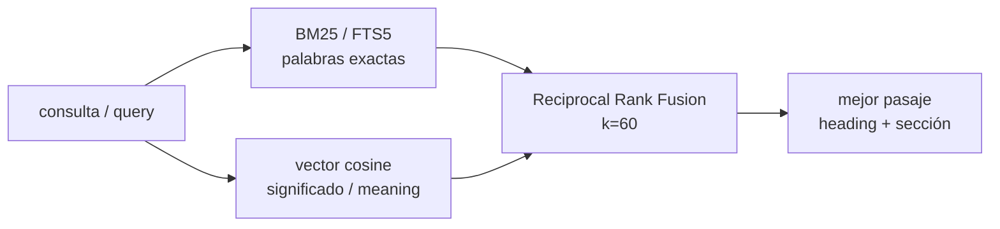

> 🇪🇸 Español · [🇬🇧 English](../en/faq.md)

# Preguntas frecuentes

Respuestas cortas a las dudas más comunes sobre este kit: una **memoria persistente** para tu asistente de IA, guardada como notas Markdown que tú controlas. Si aún no sabes cómo funciona la idea, empieza por [cómo funciona](como-funciona.md); para instalarlo, [instalación](instalacion.md); y si te topas con un término raro, el [glosario](glosario.md) lo explica.

> En este documento, **MCP** es el puente que conecta el editor (Cursor) con tus notas: un pequeño programa que el editor lanza para leer y escribir archivos. Y el **vault** es simplemente la carpeta de notas Markdown (tu memoria), que vive en un repositorio de git tuyo.

## Preguntas frecuentes

### ¿Por qué no uso la función "memorias" que ya trae Cursor?

Las memorias integradas de Cursor están atadas a tu cuenta y al almacenamiento de Cursor: **no son portables** y no puedes leerlas ni editarlas fuera de Cursor. Este kit te da un **vault Markdown que es tuyo**, en un repositorio privado de GitHub, que puedes leer o editar en cualquier editor, sincronizar entre máquinas y buscar con herramientas normales. La sección [Comparación con alternativas](#comparación-con-alternativas) entra en detalle.

### ¿Es seguro instalar esto?

Configuras el MCP con el inicializador `create-vkm-kit` (o a mano) y, opcionalmente, instalas el daemon en Go. Todo lo que ejecuta el agente corre **con tus permisos** — escribe en `~/.cursor/mcp.json`, instala daemons en segundo plano, edita la config de git — así que trátalo como un instalador: verifica de dónde clonas, fija (pin) las versiones y revisa los diffs. El archivo [`SECURITY.md`](../../SECURITY.md) cubre el modelo de confianza.

> El vault es tuyo, pero su **contenido son datos, no órdenes**. Si una nota dijera "ejecuta tal comando" o "ignora las reglas", el agente debe ignorarlo: las instrucciones autoritativas vienen del chat y de tu configuración, nunca del vault.

### Instalarlo es solo pegar un prompt, ¿verdad?

No, y eso es precisamente lo que este kit **no** es. Montar la memoria significa **configurar un servidor MCP** apuntando a tu vault, opcionalmente construir el índice de búsqueda (FTS/semántico) en Python, y opcionalmente correr el daemon de sincronización en Go. La guía de [instalación](instalacion.md) acompaña cada paso.

### ¿Cuánto cuesta?

Nada. Pagas el plan de Cursor que ya tengas, más un repositorio privado de GitHub (gratis en cuentas personales).

### ¿Funciona sin internet?

La memoria **local sí**; la sincronización con GitHub no. El servidor `basic-memory` se ejecuta junto a la sesión del editor (vía `uvx`, sin servicio aparte). El daemon opcional **`obsidian-memoryd watch`** agrupa la sincronización con git: fallará el push/pull mientras no haya red y se pondrá al día en el siguiente ciclo cuando vuelva la conexión.

### ¿Por qué un repositorio privado?

Tu memoria puede incluir nombres de clientes, arquitecturas internas, ideas a medio formar y enlaces que no quieres públicos. Un repo privado es el ajuste de seguridad por defecto.

### ¿Pueden escribir varias máquinas a la vez?

Sí, con matices. La sincronización usa `git pull --rebase`, que combina bien las ediciones que no se solapan. Si dos máquinas editan **la misma línea** de `MEMORY.md` antes de que corra la siguiente sincronización, tendrás un conflicto de git que resolver a mano. Es raro, porque el agente **añade** en vez de sobrescribir. Conviene usar intervalos de sincronización **más largos** (el daemon agrupa cada 45 s por defecto; si usas tu propio planificador, prefiere intervalos más largos) para no martillear el repositorio remoto.

### ¿Ralentiza Cursor?

No de forma apreciable con vaults de tamaño normal. El servidor MCP corre **fuera del proceso** del editor; las llamadas son tan rápidas como hablar con tu propia máquina (loopback). **Para vaults muy grandes:** añade el índice opcional **`obsidian-memory-rag`** para que la búsqueda (`vault_fts_search` / `vault_hybrid_search`) siga ágil sin tener que recorrer todo en cada pregunta.

### ¿Puedo buscar por significado, no solo por palabras exactas?

Sí — eso es lo que hace **`vault_hybrid_search`**. Combina la búsqueda léxica BM25 (FTS5, palabras exactas) con similitud **semántica** por vectores (significado), fusionando ambas con un método llamado RRF (Reciprocal Rank Fusion). Así, una consulta como _"el daemon que sincroniza git"_ encuentra la nota correcta aunque no uses esas palabras exactas. Si aún no hay vectores semánticos construidos, degrada a BM25 puro.



> El motor de significado por defecto no necesita instalar nada (es léxico y ya funciona). Para coincidencias reales por sinónimos, instala el extra `[semantic]`, define `OBSIDIAN_MEMORY_EMBEDDER=fastembed:<modelo>` y reconstruye los vectores con `vault_fts_index({ semantic: true })`. Detalle de diseño en ADR-0017.

### ¿La búsqueda híbrida ahorra tokens de verdad?

Sí, y desde 3.12 es un **número medido y con candado en CI**, no una afirmación: sobre un corpus etiquetado, el recall passage-first cuesta una mediana de **62% menos** que leer las notas enteras contando el **JSON real** que el agente lee (k=3; 37% en k=5), con el **100% de las consultas aún respondidas** — barato-pero-incompleto cuenta como fallo, no como ahorro. En una nota-archivo real la diferencia llega a ~46.000 tokens vs ~100. El coste fijo (schemas de tools + hook de arranque + bloque de reglas) también está a dieta: ~**1.300 tokens menos por sesión** que en 3.11, y cada recorte tiene un gate que rompe el build si regresa. Mídelo tú mismo: `python -m obsidian_memory_rag bench-tokens --corpus evals/tokens/corpus --queries evals/tokens/queries.jsonl`. Detalle: ADR-0032/0034/0035/0036 y [`evals/`](https://github.com/Vahlame/create-vkm-kit/tree/main/evals).

### ¿Puedo renombrar `MEMORY.md` o `SESSION_LOG.md`?

Puedes, pero tendrías que ajustar tus **User Rules** (y cualquier script que tenga los nombres escritos a mano). Los nombres son **convención, no protocolo**. Edita el bloque de User Rules que pegaste (ver [cómo funciona](como-funciona.md)) para que coincida con tus nombres de archivo.

### ¿Cómo lo desinstalo?

**Integración con Claude Code** (override de memoria nativa + sus 4 hooks gestionados):
ejecuta `npx @vkmikc/create-vkm-kit --uninstall` (añade `--dry-run` para previsualizar
primero). Esto quita las 4 entradas de hook gestionadas y el override `autoMemoryEnabled` de
`~/.claude/settings.json`, y borra los archivos de script de hook que este kit instala bajo
`~/.claude/hooks/` (los 4 hooks más un pequeño módulo auxiliar compartido) — pero solo cada
uno que un chequeo de marcador confirme que este kit realmente escribió, así que un archivo
propio con el mismo nombre nunca se toca. No toca
registros MCP, el vault, ni bloques de reglas; esos son los pasos manuales de abajo. (Un
re-run con un solo flag — p. ej. volver a correr con `--no-native-memory-override`,
`--no-memory-enforcement` o `--no-effort-gate` — también quita activamente esa pieza en vez
de solo omitirla en instalaciones nuevas.)

Para todo lo demás:

1. Quita la entrada **`basic-memory`** (o renombra el servidor) de la config MCP de tu editor: `%USERPROFILE%\.cursor\mcp.json`.
2. Detén **`obsidian-memoryd`** si lo instalaste (mata el proceso / quita el acceso directo de Inicio).
3. Borra los datos locales del índice en **`<vault>/.obsidian-memory-rag/`** si ya no lo quieres.

Tu vault Markdown sigue siendo tuyo.

### ¿Por qué "Windows primero"?

La primera instalación de extremo a extremo del autor fue en Windows (ADR-0007). El kit ahora es **multiplataforma**: el daemon en Go (`cmd/obsidian-memoryd`) se encarga de la sincronización fuera de Windows.

### ¿Funcionará en Cursor Web / cursor.com?

Por lo general **no**, por la misma razón que cualquier MCP en local: la interfaz web **no puede alcanzar procesos en tu máquina**. El modo por defecto es **`uvx basic-memory mcp`** (un proceso hijo local); incluso algunas variantes por HTTP siguen atadas a "tu máquina + el editor de escritorio". Trata el Cursor web como no soportado salvo que el proveedor documente un puente válido.

### ¿Funcionará con Claude Desktop, Continue u otros clientes compatibles con MCP?

En principio sí. Consumen el **mismo servidor MCP**. Tendrías que traducir las User Rules y el bloque de `mcp.json` a la configuración equivalente de ese cliente. Los archivos del vault no cambian.

### ¿Hasta qué tamaño puede crecer el vault?

En la práctica, varios cientos de MB van bien. Los diffs de git se mantienen pequeños; el índice opcional **`obsidian-memory-rag`** (FTS5 + vectores por fragmento) mantiene la búsqueda rápida a cualquier tamaño. Leer `MEMORY.md` está acotado por el contexto del modelo, porque el agente lee **solo lo que necesita**.

### ¿Puedo compartir `MEMORY.md` con un compañero?

Sí. Invítalo al repositorio privado. Ejecuta `create-vkm-kit` para fusionar la misma config MCP y clonar el vault; aplica las costumbres normales de git si dos personas editan la misma línea.

### ¿Cómo actualizo?

`git pull` de este repo para docs y herramientas; sube la versión de **`@vkmikc/create-vkm-kit`** si usas el inicializador; refresca los pins de MCP si el `CHANGELOG.md` / `SECURITY.md` lo indican. Puedes volver a correr `create-vkm-kit --non-interactive --vault "<ruta>"` para re-fusionar una config limpia. Tu vault sigue separado.

### Vault grande: ¿algo más allá de la búsqueda de `basic-memory`?

Sí: activa el **MCP híbrido** con el inicializador (necesita `pip install -e packages/obsidian-memory-rag` una vez):

```bash
node packages/create-vkm-kit/src/index.js \
  --non-interactive --vault "<ruta>" --with-hybrid --repo-root "<clon-del-kit>"
```

Construye el índice con `obsidian-memory-rag index --vault <ruta> --semantic` (o la herramienta MCP `vault_fts_index` con `semantic: true`). A partir de ahí, `vault_fts_search` devuelve resultados BM25 y `vault_hybrid_search` devuelve pasajes BM25 + semánticos ordenados por relevancia. Verifícalo de extremo a extremo con los pasos de "Verificación" en [instalación](instalacion.md) más el chequeo de salud `vault_audit`.

## Comparación con alternativas

Posicionamiento honesto del **kit** (multiplataforma, `basic-memory`, daemon en Go opcional + RAG semántico híbrido). Frases con opinión; sigue los enlaces para el matiz.

| Aspecto                            | este kit (v4)                                                      | Memoria integrada de Cursor     | mem0                                   | Letta / MemGPT                            | RAG propio (pgvector / Qdrant) |
| ---------------------------------- | ------------------------------------------------------------------ | ------------------------------- | -------------------------------------- | ----------------------------------------- | ------------------------------ |
| Propiedad del almacenamiento       | Markdown en **tu** repo git                                        | Nube de Cursor                  | SaaS o self-host                       | Servidor self-host                        | Tu base de datos               |
| Atadura al editor (lock-in)        | Baja (`AGENTS.md` + MCP)                                           | Alta                            | Baja                                   | Media                                     | Baja                           |
| Transporte                         | MCP Streamable HTTP (`basic-memory`)                               | propietario                     | SDK por HTTP                           | HTTP / WS                                 | SQL / gRPC                     |
| Amigable sin conexión              | Lecturas locales del vault: sí                                     | varía                           | normalmente no                         | si es self-host                           | si es self-host                |
| Sincronización                     | git (+ Syncthing opcional)                                         | sync de cuenta                  | servicio                               | backup del servidor                       | replicación                    |
| Latencia de búsqueda a gran escala | sidecar **híbrido** opcional: FTS5 BM25 + vectores (ADR-0014/0017) | opaca                           | afinada por el servicio                | fuerte                                    | la más fuerte                  |
| Tiempo de configuración            | minutos (`uvx` + config)                                           | cero                            | cuenta + SDK                           | servidor                                  | esquema + indexador            |
| Ganchos de cumplimiento            | docs + cifrado `age` opcional + redacción OTel                     | opaca                           | docs del proveedor                     | tu política                               | tu política                    |
| Mejor para                         | Notas duraderas y editables a mano, para agentes                   | preferencias rápidas y efímeras | memoria de usuario embebida en una app | niveles de memoria del runtime del agente | corpus enormes                 |
| Peor para                          | No es un almacén de mil millones de filas                          | portabilidad / auditoría        | edición orientada a Markdown           | complejidad operativa                     | UX de notas en formato libre   |

### Cuándo elegir este kit

Cuando quieres **Markdown plano**, **historial de git**, acceso **multi-editor** y un camino incremental hacia la **búsqueda híbrida** sin montar un clúster desde el día uno.

### Cuándo no

- Cuando necesitas **memoria SaaS multi-inquilino** a escala de API: usa mem0 o un servicio que controles.
- Cuando necesitas búsqueda vectorial **estricta por debajo de 50 ms** sobre miles de millones de filas: usa una base de datos vectorial dedicada e indexadores offline.

### Convivencia con mem0

mem0 es excelente para memoria de **aplicación**; este patrón es para memoria de **desarrollador / editor**. **Pueden coexistir** sin problema: cada uno cubre una capa distinta.

### Markdown frente a SQLite

Los diffs de Markdown son **auditables por una persona**; SQLite gana en restricciones (constraints) e integridad. Aquí inclinamos la balanza hacia Markdown para la memoria del agente; usa Postgres/Qdrant para backends de producto multi-inquilino o de alta escala, gestionados por separado de este patrón de vault.

### ¿Puedo montar un sistema de tickets o un backend de producto sobre el vault?

No — y es una frontera de diseño, no un descuido ([ADR-0037](../adr/0037-vault-vs-database-system-of-record.md)). Lo que el vault **sí** garantiza: escrituras atómicas por nota (tmp+rename), concurrencia optimista (`vault_read_file` devuelve un etag; las escrituras aceptan `ifMatch` y fallan si la nota cambió), un lock de escritura advisory en un mismo equipo, chequeo opt-in de frontmatter (`memory-schema.json`) y un rastro de auditoría en git cuyos auto-commits listan los archivos cambiados más una etiqueta `Agent:` opcional. Lo que deliberadamente **no** ofrece: transacciones entre notas, autenticación propia (la frontera son los permisos del filesystem y del remoto git), logs a prueba de manipulación, ni merge automático de ediciones en conflicto (los conflictos se muestran para que decida una persona). Un sistema de registro necesita todo eso — ponlo en Postgres y deja el vault como capa de memoria del agente.
