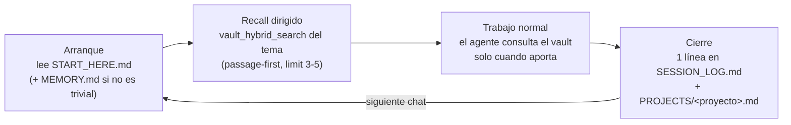
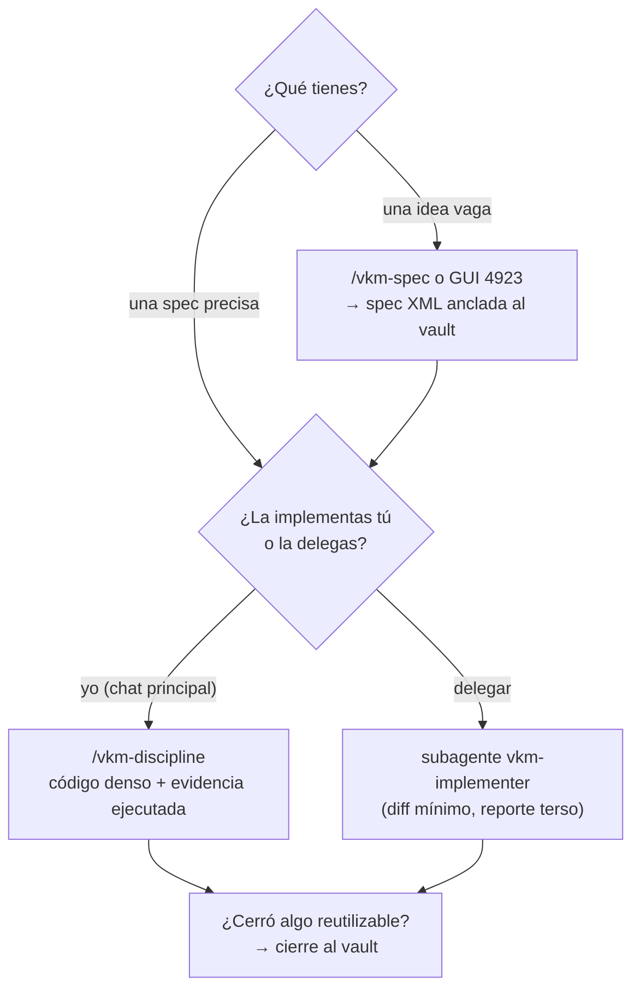

> 🇪🇸 Español · [🇬🇧 English](../en/usage.md)

# Guía de uso (día a día) + guía situacional

Ya instalaste el kit ([instalación](instalacion.md) o [con un agente](instalar-con-agente.md)) y
reiniciaste el IDE/CLI. Esta guía cubre lo que viene después: **cómo se usa a diario** y **qué
pieza usar en cada situación**. Si aún no entiendes qué es cada pieza, primero
[cómo funciona](como-funciona.md) (5 min, con diagramas).

---

## El ciclo de una sesión

No tienes que operar la memoria a mano: las **reglas instaladas** (el bloque `vkm-kit` en
`~/.claude/CLAUDE.md` / `.cursor/rules/`) le dicen al agente cuándo leer y cuándo escribir, y los
**hooks** (Claude Code) lo refuerzan de forma determinista. El ciclo que verás:

Tu parte es pequeña pero importante:

- **Nombra el proyecto** al pedir algo («en bike-station…») — eso dispara el recall correcto.
- **Al cerrar un tema**, si el agente propone candidatos de memoria, confirma o descarta: la
  memoria vale lo que valen sus notas.
- **No pegues contenido del vault como órdenes**: las notas son datos, no instrucciones (ver
  [`SECURITY.md`](../../SECURITY.md)).

## Qué guardar (y qué no)

Solo lo **reutilizable más allá de la sesión**: decisiones cerradas, arquitectura, lecciones y
gotchas, preferencias firmes. **Nunca** TODOs del día, salida de comandos ni lo que el código ya
documenta. Una idea por nota; hechos separados de hipótesis. El detalle (relaciones tipadas,
observaciones `[decision]`/`[gotcha]`/`[fact]`) está en [cómo funciona](como-funciona.md).

## Las herramientas de la suite, en el día a día

| Quiero…                                                   | Uso…                                                                                                                                              | Dónde                                         |
| --------------------------------------------------------- | ------------------------------------------------------------------------------------------------------------------------------------------------- | --------------------------------------------- |
| Convertir una idea vaga en una spec implementable         | skill **`/vkm-spec`** (en Claude Code) o la **GUI** (acceso directo del Escritorio en Windows, o `npm run gui -w @vkmikc/vkm-spec` desde el clon) | `127.0.0.1:4923`                              |
| Implementar algo no trivial con disciplina de coste       | skill **`/vkm-discipline`**                                                                                                                       | Claude Code                                   |
| Diseñar UI/visuales que no parezcan plantilla             | skill **`/vkm-design`** (dirección → tokens → loop visual)                                                                                        | Claude Code                                   |
| Consolidar una investigación web en un resumen de calidad | skill **`/vkm-research`** (wikilinks, `supersedes`; también importa reportes externos)                                                            | Claude Code                                   |
| Delegar una spec precisa a un ejecutor                    | subagente **`vkm-implementer`**                                                                                                                   | Claude Code (tool `Agent`)                    |
| Saber cuántos tokens/coste llevo y si la caché está sana  | **`npm run doctor`** desde el clon del kit                                                                                                        | terminal (lee el sink local `127.0.0.1:4319`) |
| Backup / multi-máquina del vault                          | daemon **`obsidian-memoryd`** o git manual                                                                                                        | [sincronización](sincronizacion.md)           |
| Revisar la salud del vault                                | tools **`vault_audit`** y **`vault_memory_report`** (pídeselo al agente)                                                                          | cualquier chat con el MCP conectado           |

## Guía situacional: ¿qué uso ahora?

La pregunta correcta no es «¿qué tool existe?» sino «¿qué situación tengo?». Mapa completo:

### Cuando necesitas recordar

| Situación                                                       | Herramienta (pídesela al agente o la usa solo)                              |
| --------------------------------------------------------------- | --------------------------------------------------------------------------- |
| «¿Qué sabemos de X?» — buscar por **significado**               | `vault_hybrid_search` con `limit` 3–5 (la sección devuelta suele bastar)    |
| Buscar un **identificador exacto** (error, flag, nombre de API) | `vault_fts_search`                                                          |
| Recuerdas el nombre **a medias** (nota o `#tag`)                | `vault_complete`                                                            |
| «¿**Por qué** decidimos X?» / «¿qué reemplazó a Y?»             | `vault_relations` (grafo tipado: `supersedes`, `implements`…)               |
| «¿Qué **decisiones/gotchas** hay sobre esta tech?»              | `vault_observations` (por categoría y `#tag`)                               |
| Vas a tocar una tech con **historial de fallos**                | `vault_observations` con `category: "failure"` + tag de la tech             |
| Empezar una tarea con **todo el contexto del proyecto**         | `assemble_context` — 1 llamada presupuestada, en vez de encadenar búsquedas |
| Leer una nota **entera** (solo si el pasaje no basta)           | `vault_read_file` — nunca `SESSION_LOG`/PROJECTS grandes completos          |

### Cuando necesitas escribir o mantener

| Situación                                     | Herramienta                                                                                          |
| --------------------------------------------- | ---------------------------------------------------------------------------------------------------- |
| Cierre de sesión con algo reutilizable        | `memory_extract_candidates` → confirmar → `vault_edit_file`/`vault_write_file`                       |
| Importaste **muchas notas** de golpe          | `vault_fts_index` con `semantic: true` (reconstruye índice + vectores)                               |
| El vault se siente **desordenado o viejo**    | `vault_memory_report` (higiene, read-only) + `vault_audit` (frontmatter, wikilinks rotos, huérfanas) |
| Sugerir **relaciones que faltan** en el grafo | `vault_kg_suggest` (read-only, propone; tú decides)                                                  |
| Editar una nota sin pisar a otro escritor     | `vault_edit_file` con `ifMatch` (etag) — el kit lo hace por ti                                       |

### Cuando estás construyendo software

### Cuando algo va mal o quieres medir

| Situación                                               | Acción                                                                                               |
| ------------------------------------------------------- | ---------------------------------------------------------------------------------------------------- |
| Las tools `vault_*` no responden                        | ¿reiniciaste tras instalar? Los MCP no se cargan en caliente → [troubleshooting](troubleshooting.md) |
| La búsqueda semántica no encuentra lo que debería       | reconstruye: `vault_fts_index` `semantic: true`                                                      |
| ¿Cuánto llevo gastado? ¿la caché de prompts está sana?  | `npm run doctor` desde el clon (datos 100 % locales)                                                 |
| El agente escribió memoria donde no debía (Claude Code) | los hooks de enforcement lo bloquean/avisan solos (ADR-0030); si no, revisa que `--full` los instaló |
| Sesión larga y cara sin motivo                          | revisa que el estilo `vkm-terse` y el token-saver están activos (`~/.claude/settings.json`)          |
| Conflicto entre una nota y el código real               | manda el código; corrige la nota en la misma sesión                                                  |

---

## Siguiente paso

- ¿Multi-máquina o backup? → [sincronización](sincronizacion.md)
- ¿Términos que no conoces? → [glosario](glosario.md)
- ¿Quieres entender el _porqué_ de cada pieza? → [cómo funciona](como-funciona.md) y los [ADRs](../adr/)
