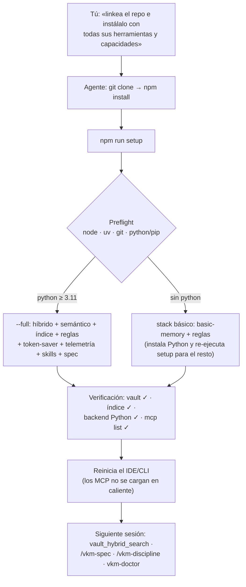

> 🇪🇸 Español · [🇬🇧 English](../en/install-with-agent.md)

# Instalar con un agente (pégalo en el chat)

¿No quieres seguir la [guía manual](instalacion.md)? Pega el bloque de abajo en un chat de
**Cursor** o **Claude Code**: el agente instala y verifica todo, y tú solo **apruebas los
comandos**. Funciona para ambos IDEs — la instalación básica no necesita clon.

> ## ⚠️ Antes de pegar esto — es una acción tipo `curl … | sh`
>
> El bloque autoriza a un agente a instalar un paquete npm, editar tu config MCP y tocar git.
> Pégalo **solo desde este repo** (<https://github.com/Vahlame/create-vkm-kit>) y verifica que
> el paquete que instala es **`@vkmikc/create-vkm-kit`**. Si algo no cuadra, no pegues nada
> y abre un issue.

---

## ⚡ Lo más simple: linkea el repo al agente y di «instálalo»

¿Tienes (o el agente clona) el repo? Entonces no necesitas pegar ningún prompt largo — hay un
**punto de entrada único y auto-verificante**. Dile al agente exactamente esto:

> «Clona <https://github.com/Vahlame/create-vkm-kit> e **instálalo con todas sus herramientas y
> capacidades**: entra a la carpeta y ejecuta `npm install` y luego `npm run setup`. Aprobaré los
> comandos.»

El agente terminará ejecutando esto (y nada más — cualquier otro comando, recházalo):

```bash
git clone https://github.com/Vahlame/create-vkm-kit
cd create-vkm-kit
npm install
npm run setup            # opciones: npm run setup -- --vault "<RUTA>" --ide codex,claude
```

`npm run setup` hace **preflight** de dependencias (`node`, `uv`, `git`, `python`/`pip`),
**autodetecta** qué CLIs de agente tienes en PATH (`codex`, `claude`; si no, cae a Cursor),
ejecuta la instalación **`--full`**, **verifica** (vault en disco, índice construido, backend
Python importable, `codex/claude mcp list`) e imprime una tabla de estado.
`npm run setup:dry` lo previsualiza sin escribir nada.



### Qué significa «todas sus herramientas y capacidades»

Con Python ≥ 3.11 presente, `npm run setup` instala la suite 4.0 completa en un solo pase:

| Pieza                                                                                 | Qué te da                                                                                                                   |
| ------------------------------------------------------------------------------------- | --------------------------------------------------------------------------------------------------------------------------- |
| **Vault + MCP `basic-memory`**                                                        | memoria Markdown que sobrevive entre chats (leer/escribir/buscar), con versión fijada                                       |
| **MCP `obsidian-memory-hybrid`**                                                      | búsqueda passage-first (BM25 + semántica + grafo), knowledge graph tipado, `vault_audit`, memory reports                    |
| **Índice FTS + sqlite-vec**                                                           | búsqueda por significado, acelerada — en `<VAULT>/.obsidian-memory-rag/`                                                    |
| **Reglas de memoria**                                                                 | protocolo del agente como bloque marcado idempotente en `~/.claude/CLAUDE.md`, `AGENTS.md` y `.cursor/rules/`               |
| **token-saver** _(Claude Code)_                                                       | hooks de compactación de salida ruidosa + deny rules de artefactos + estilo `vkm-terse` (ADR-0043)                          |
| **Telemetría local + `vkm-doctor`** _(Claude Code)_                                   | sink OTLP en `127.0.0.1:4319`; `npm run doctor` reporta tokens, coste y salud de caché — nada sale de tu máquina (ADR-0044) |
| **Skills `/vkm-discipline` y `/vkm-spec` + agente `vkm-implementer`** _(Claude Code)_ | disciplina de código denso + pipeline idea→spec anclada al vault (ADR-0049)                                                 |
| **vkm-spec GUI**                                                                      | de idea a spec XML en `127.0.0.1:4923`, corre desde el clon                                                                 |
| **Ollama + `phi4-mini`** _(≈2,3 GB; best-effort)_                                     | redacción local de specs; si falla o lo evitas con `--no-ollama`, vkm-spec usa su fallback determinista (ADR-0047)          |
| **Hooks de memoria** _(Claude Code)_                                                  | auto-memoria nativa OFF + enforcement determinista + effort-gate (ADR-0029/0030/0031)                                       |

Las piezas marcadas _(Claude Code)_ se instalan solo si el CLI `claude` está en PATH (o pasas
`--ide claude`). Sin clon del kit, la parte híbrida degrada a `basic-memory` con aviso — nunca
aborta.

> **Límite honesto:** registrar un MCP **no** activa sus tools en la sesión actual — ningún agente
> puede cargar sus propios MCP en caliente. Tras `npm run setup`, **reinicia** Claude Code / Codex
> (o recarga la ventana de Cursor); las tools de memoria (`vault_hybrid_search`, …) responden en la
> **siguiente** sesión. El agente puede confirmar el cableado con `claude mcp list` / `codex mcp list`.

¿Sin clon (solo `npx`, instalación básica)? Usa el prompt de abajo.

---

**Copia desde aquí hacia abajo y pégalo en un chat nuevo del agente:**

---

Eres un agente de Cursor o Claude Code. Instala y **verifica** el sistema de **memoria Markdown**
en esta máquina. Ejecuta cada comando, **reporta su resultado** y pide aprobación antes de
cualquier cosa que instale software.

**1 · Prerrequisitos.** Deben existir; instala lo que falte y luego pídeme reabrir la terminal
para que se refresque el `PATH`:

```bash
node --version   # ≥ 20
uvx --version    # cualquiera — ejecuta el MCP basic-memory
git --version    # cualquiera
```

> Windows: `winget install OpenJS.NodeJS.LTS astral-sh.uv Git.Git` · macOS: `brew install node uv git`.

**2 · Instalar — un solo comando.** Pregúntame la carpeta del vault (por defecto
`~/Documents/obsidian-memory-vault`, en Windows `%USERPROFILE%\Documents\obsidian-memory-vault`);
llámala `<VAULT>`. Ejecuta la línea del IDE en el que corres — pregúntame si no estás seguro:

```bash
# Cursor
npx @vkmikc/create-vkm-kit "<VAULT>" -y --rules all

# Claude Code  (registra vía `claude mcp add`, no mcp.json)
npx @vkmikc/create-vkm-kit "<VAULT>" -y --ide claude --rules all
```

Un comando hace todo: crea el vault si no existe (`START_HERE.md`, `MEMORY.md`, `SESSION_LOG.md`,
`PROJECTS/`), conecta el MCP **`basic-memory`** con versión fijada (haciendo backup de tu config
previa primero), e instala las **User Rules** de memoria como bloque marcado idempotente en
`~/.claude/CLAUDE.md`, `./AGENTS.md` y `.cursor/rules/` (nunca pisa tu contenido). Muestra la
salida y confirma que no hubo errores.

**3 · User Rules globales de Cursor (solo Cursor).** El Paso 2 ya escribió la regla de _proyecto_
(`.cursor/rules/obsidian-memory.mdc`). Para cobertura _global_, muéstrame el bloque marcado (entre
los marcadores `vkm-kit:start`/`end`) y dime que lo pegue en
**Cursor → Settings → Rules → User Rules** — Cursor guarda las reglas globales fuera de cualquier
archivo. **Claude Code: omite esto** — `~/.claude/CLAUDE.md` ya quedó hecho.

**4 · Reinicia y verifica.** Dime que ejecute **Developer: Reload Window** (Cursor) o reinicie
Claude Code. Luego, en un chat nuevo, comprueba que funciona:

```text
Lee START_HERE.md de mi vault y dime qué contiene.
```

Si vuelve el contenido, reporta una tabla de estado — vault (`<VAULT>`) ✓ · MCP conectado ✓ ·
reglas instaladas ✓ · prueba de lectura ✓. Si falla, consulta
[`troubleshooting.md`](troubleshooting.md) → **MCP / Cursor**.

**5 · (Opcional) Búsqueda híbrida — solo vaults grandes.** Buscar por palabra **y** por significado
necesita el kit **clonado** y Python ≥ 3.11. Pídeme una ruta de clon `<KIT>` y luego:

```bash
git clone https://github.com/Vahlame/create-vkm-kit "<KIT>"
pip install -e "<KIT>/packages/obsidian-memory-rag[semantic,vec]"
node "<KIT>/packages/create-vkm-kit/src/index.js" -y --vault "<VAULT>" --with-hybrid --semantic --vec --build-index --repo-root "<KIT>"
```

En Claude Code añade `--ide claude` a la última línea. Reinicia el IDE; entonces responden las
tools `obsidian-memory-hybrid` (`vault_hybrid_search`, …).

---

— fin del bloque para pegar —

> ¿Montas una **máquina nueva completa** (clonar tu repo privado del vault, `CLAUDE.md` global y el
> índice semántico de una vez)? Usa [`instalar-pc-nueva.md`](instalar-pc-nueva.md) en su lugar.

**¿Ya instalado y reiniciado?** Siguiente parada: la
[**guía de uso + situacional**](guia-de-uso.md) — qué pieza usar en cada situación del día a día.
